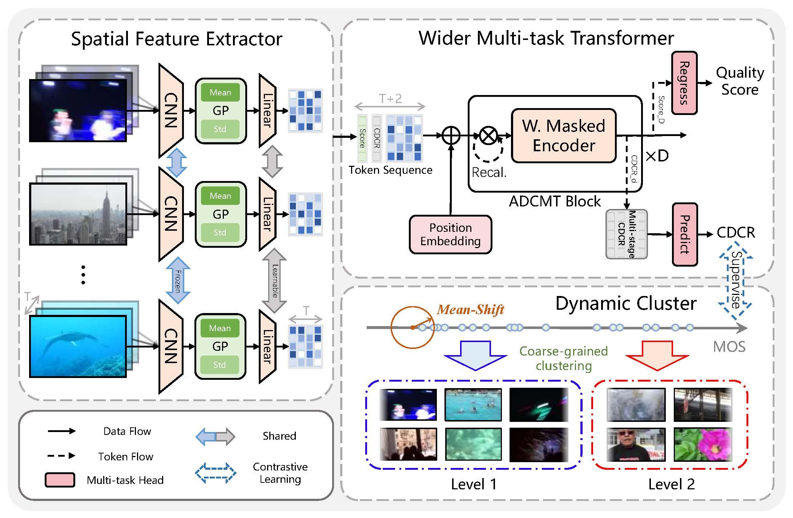

# ADCMT: An Augmentation-Free Dynamic Contrastive Multi-Task Transformer for UGC-VQA

**Paper**: [ADCMT: An Augmentation-Free Dynamic Contrastive Multi-Task Transformer for UGC-VQA](https://ieeexplore.ieee.org/document/11006507)

**Authors**: Hui Li, Kaibing Zhang, Jie Li, Xinbo Gao, Guang Shi  

**Published in**: IEEE Transactions on Broadcasting, 2025  

---

## I. 简介 / Introduction

本仓库提供论文《ADCMT: An Augmentation-Free Dynamic Contrastive Multi-Task Transformer for UGC-VQA》的官方代码与复现说明。ADCMT 针对用户生成内容（UGC）视频中的复杂失真和数据稀缺，提出了一种**无需数据增强**的多任务对比学习 Transformer 框架，有效提升了视频质量评价（VQA）任务的精度与泛化能力。

This repository provides the official implementation and reproduction instructions for our IEEE TBC 2025 paper:  
**ADCMT: An Augmentation-Free Dynamic Contrastive Multi-Task Transformer for UGC-VQA**.  
ADCMT tackles the complex multi-source distortions in user-generated videos without relying on artificial data augmentation, by leveraging a novel multi-task transformer and a dynamic supervised contrastive learning strategy.



---

## II. 快速开始 / Quick Start

1. 克隆仓库 / Clone the repository

   ```bash
   git clone https://github.com/kbzhang0505/ADCMT.git
   cd ADCMT
   ```

2. 数据集准备 / Prepare Datasets

   本项目支持 KoNViD-1k、CVD2014、LIVE-Qualcomm、LIVE-VQC、YouTube-UGC、LSVQ-Subset 等主流 UGC-VQA 数据集。请分别在 `data/` 目录下准备原始视频和标签文件，目录结构如下：

   This project supports mainstream UGC-VQA datasets including KoNViD-1k, CVD2014, LIVE-Qualcomm, LIVE-VQC, YouTube-UGC, and LSVQ-Subset. Please prepare the raw videos and annotation files for each dataset under the `data/` directory with the following structure:

   ```bash
   ADCMT/
   ├── data/                  # 数据集元文件及划分 / Dataset meta files and splits
   ├── models/                # 模型实现 / Model implementations
   ├── modules/               # 方法模块 / Method modules
   ├── tools/                 # 工具函数 / Utility functions
   ├── main_ADCMT.py          # 训练入口 / Main training entry
   ├── sample_LSVQ.py         # LSVQ数据集子集采样 / LSVQ subset sampling script
   ├── shell_ADCMT.py         # 重复实验运行脚本 / Batch experiment shell script
   ├── V_feat_Dataset.py      # PyTorch数据集类定义 / PyTorch Dataset class definition
   ├── README.md              # 项目说明文档 / Project documentation
   ```

3. 特征提取 / Feature Extraction

   推荐使用论文同款 ResNet50 进行帧级特征提取，脚本参考 `tools/CNN_feature_generator.py`。

   It is recommended to use the same ResNet50 model as in the paper for frame-level feature extraction. Please refer to the script `tools/CNN_feature_generator.py`.

---

## III. 引用本论文 / Citation

如果本项目或论文对您的研究有帮助，欢迎引用以下论文：

If you find this work or code useful in your research, please consider citing our paper:

```bibtex
@ARTICLE{11006507,
  author={Li, Hui and Zhang, Kaibing and Li, Jie and Gao, Xinbo and Shi, Guang},
  journal={IEEE Transactions on Broadcasting}, 
  title={ADCMT: An Augmentation-Free Dynamic Contrastive Multi-Task Transformer for UGC-VQA}, 
  year={2025},
  volume={},
  number={},
  pages={1-16},
  keywords={Augmentation-free;multi-task transformer;supervised contrastive learning;user generated content;video quality assessment},
  doi={10.1109/TBC.2025.3565888}}
```

